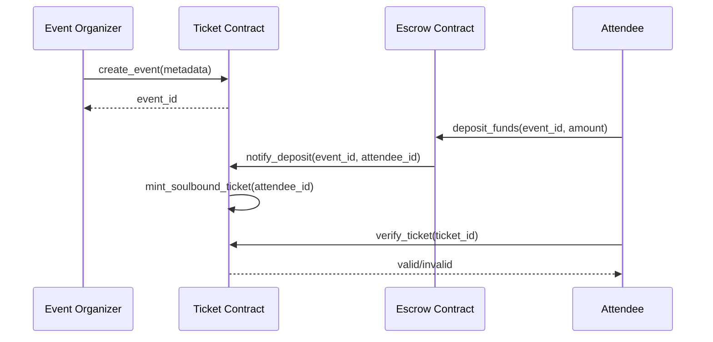
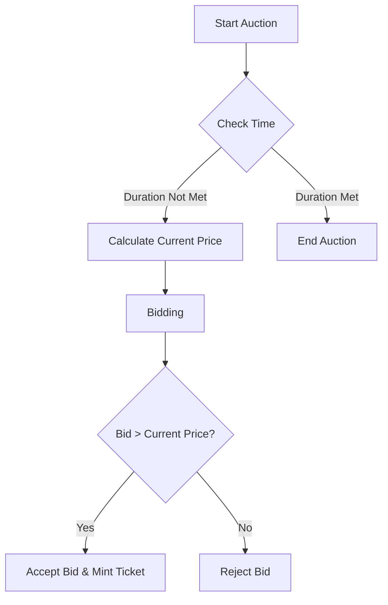
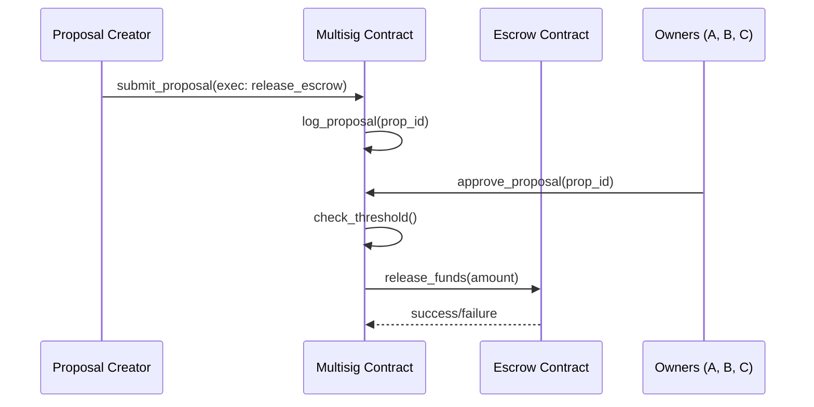

# Contract Interactions and Data Flow

This document describes how different Gathera contracts interact with each other and how data flows through the system.

## 1. Ticketing Workflow

The following diagram illustrates the flow from creating an event to minting and verifying soulful tickets.

## 2. Dutch Auction for Premium Tickets

The following diagram describes the pricing and purchase flow during a Dutch auction.

## 3. Multisig Engagement

Organizations use the multisig wallet for critical operations like releasing large escrow balances.

## 4. Security Considerations

- **Reentrancy**: All contracts follow the checks-effects-interactions pattern to prevent reentrancy.
- **Access Control**: Roles are strictly verified on every sensitive function call.
- **Gas Limit Protection**: Transactions are batched to avoid hitting the Soroban 5MB WASM limit and CPU constraints.
- **Data Integrity**: Critical states (e.g., ticket ownership) use `Persistent` storage to ensure permanence.
